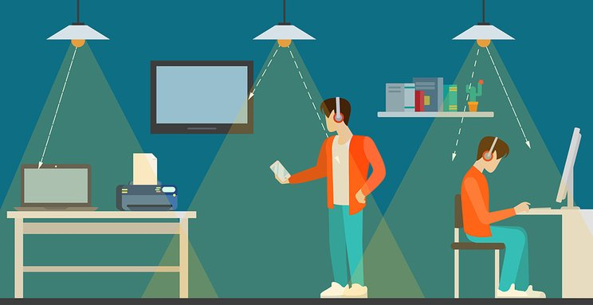

## Welcome to GitHub Pages

## Teknologi Li-Fi

**Li-Fi** merupakan sebuah teknologi yang dapat memancarkan sinyal interner melalui cahaya Lampu LED. Li-Fi atau Light fidelity merupakan teknologi terbaru yang memungkinkan internet dapat terhubung melalui cahaya. Berbeda dengan Wifi.

sedangkan **Wifi** merupakan sebuah pemancar jaringan nirkabel yang dapat memancarkan jaringan internet melalui frekuensi radio.

gambaran kinerja Li-Fi

Kecepatan Li-Fi juga jauh lebih unggul dibanding Wifi, kecepatan Li-Fi bisa sampai 10 kali lipat lebih cepat di banding wifi. Namun Li-Fi hanya dapat digunakan di satu ruangan Karena menggunakan cahaya tampak, dan cahaya tidak bisa menembus dinding, rentang sinyal tentunya jadi dibatasi oleh penghalang fisik. 
**Berikut Kelebihan dan kekurangan pada Li-Fi.**

**Kelebihan Li-Fi :**

- Efisiensi pada biaya rendah karena memerlukan komponen lebih sedikit dari teknologi sinyal radio. Energi dalam pencahayaan LED sudah efisien dan transmisi data membutuhkan daya tambahan yang diabaikan. Lingkungan transmisi pada RF dan propagasi sangat sulit, tetapi tidak pada lifi yang bekerja dengan baik dalam hal lingkungan. Keselamatan terhadap kehidupan di bumi telah berevolusi melalui paparan cahaya, sehingga tidak ada masalah keamanan atau kesehatan pada teknologi ini.dan tidak ada bahaya yang diakibatkan oleh teknologi ini karena transmisi cahaya menghindari penggunaan frekuensi radio yang dapat mengganggu sirkuit elektronik di lingkungan tertentu seperti di dalam pesawat.
- Keamanan dalam privasi sangat terjaga karena sulit dalam pencarian sinyal di luar area karena sinyal terbatas pada daerah khusus dan tidak akan menembus dinding selain kaca. Pengendalian data dapat diarahkan dari satu perangakat ke perangkat lain dan pengguna dapat melihat dimana data tersebut tersimpan. Tidak ada fitur keamanan tambahan seperti pasangan dalam interkoneksi RF pada sinyal bluetooth.

**Kekurangan Li-Fi :**

- Internet tidak bisa digunakan atau tidak dapat diakses tanpa adanya sumber cahaya sebagai pengantar sinyal. Hal ini bisa membatasi lokasi dan situasi di mana Li-Fi dapat digunakan.
- Karena menggunakan cahaya tampak, dan cahaya tidak bisa menembus dinding, rentang sinyal tentunya jadi dibatasi oleh penghalang fisik.
- Karena menggunakan cahaya tampak, dan cahaya tidak bisa menembus dinding, rentang sinyal tentunya jadi dibatasi oleh penghalang fisik.

    __Arief Armansyah__                                                                                 **11 November 2020**
